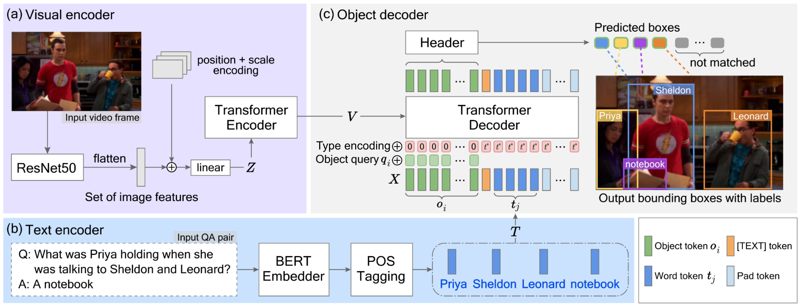

**TGOD**: Text-Guided Object Detector for Multi-modal Video Question Answering
========


Video Question Answering (Video QA)
is a task to answer a text-format question on the basis of understanding of linguistic semantics, visual information, and also linguistic-visual alignment in video. In Video QA, an object detector pretrained with large scale datasets, such as Faster R-CNN, has been widely used to extract visual representations from video frames.
However, it is not always able to precisely detect the objects needed to answer the question because of the domain gaps between the datasets for training the object detector and those for Video QA.
In this paper, we propose a text-guided object detector (TGOD), which takes text question-answer pairs and video frames as inputs and detects the objects relevant to the given text.
Our experiments using STAGE framework on the TVQA+ dataset show the effectiveness of our proposed detector. It achieves a 2.02 points improvement in accuracy of QA, 12.13 points improvement in object detection (mAP50), 1.1 points improvement in temporal location and 2.52 points improvement in ASA over the STAGE original detector.


# Usage
## Requirements
* Linux, CUDA >= 11.0, GCC>=5.4
* Python >= 3.7, Pytorch >= 1.7, torchvision >= 0.8.0
* Detectron2, scipy, h5py, spaCy


## Data preparation
1. Follow the guidance from [TVQA+ Dataset Download](http://tvqa.cs.unc.edu/download_tvqa_plus.html), 
download images and annotations of TVQA+ Dataset. Note that you may need to sign an aggrement to get permission for downloading video frames.

2. Download preprocessed features (including visual features, QA and subtitle features) provided by STAGE from [here](https://drive.google.com/file/d/1GnknXfs9qKE-WVaUgUeKfCTLHjyzqCHG/view) and put them in the `tvqa+` directory.


3. Transform the format of TVQA+ annotations for TGOD by `python tools/trans_tvqa+_anno_tgod.py`. New annotations for train/val/test set will be saved in `tgod_anno/`. You need to modify the path in the script to fit your environment. 


We expect the directory structure to be the following:
```  
tvqa+/
  frames_hq/
    bbt_frames/                     # TVQA+ video frames
  tvqa_plus_stage_features/         # preprocessed features from STAGE
  tvqa_plus_annotations/            # TVQA+ annotations
  tgod_anno/                        # TGOD annotations, ${mode} = train/val/test
    qid_qafeat_${mode}.pt           # QA pairs textual feature
    img_anno_${mode}.json           # image COCO format annotations
    extract_img_anno_${mode}.json   # image annotation for extraction, different from training
```


## Installation
### Environment
We recommend to use Anaconda to create a virtual environment:
```
conda create --name tgod python=3.7
conda activate tgod
```
### Pytorch
Then install Pytorch, please check [PyTorch install](https://pytorch.org/get-started/previous-versions/#v170) to choose a suitable command for your CUDA version. For example, with CUDA 11.0:
```
conda install pytorch==1.7.0 torchvision==0.8.0 cudatoolkit=11.0 -c pytorch
```
### Detectron2
We implement TGOD using [Detectron2](https://github.com/facebookresearch/detectron2) for better maintanence based on the wrapper from [DETR](https://github.com/facebookresearch/detr/tree/main/d2).
`Detectron2` should work for v0.3-v0.5. To install Detectron v0.3, run:
```
python -m pip install detectron2==0.3 -f \
  https://dl.fbaipublicfiles.com/detectron2/wheels/cu110/torch1.7/index.html
```
See [Official guide](https://github.com/facebookresearch/detectron2/blob/main/INSTALL.md) for more installation details.

### Other requirements
Deformable attention is implemented by CUDA, compile [CUDA operater](https://github.com/fundamentalvision/Deformable-DETR#compiling-cuda-operators) as:
```
cd ../deformable_models/ops
sh ./make.sh
# unit test (should see all checking is True)
python test.py
```

Install other requirements:
```
conda install -c anaconda scipy h5py
# spacy
conda install -c conda-forge spacy
conda install -c conda-forge cupy
python -m spacy download en_core_web_sm
```

## Training
Download the COCO pre-trained weight provided by [Deformable DETR](https://drive.google.com/file/d/1nDWZWHuRwtwGden77NLM9JoWe-YisJnA/view?usp=sharing), you may need to modify it to fit TGOD structure. We will release the modified one after the review.
Put the weight in `weight/deformable_detr_origin.pth`.

To train TGOD on a single node with 2 GPUs, simply use:
```
cd d2/
python train_net_tgod.py --config configs/tgod_full.yaml --num-gpus 2 
```


## Evaluation
To evaluate TGDO on COCO metrics with a sigle GPU, run:
```
cd d2/
python train_net_tgod.py --config configs/tgod_full.yaml --eval-only MODEL.WEIGHTS ${MODE_PATH}
```
`${MODE_PATH}` is the trained model weight path.
Note that this is just for object detection perforamce evaluation. Please use [STAGE evaluation](https://github.com/jayleicn/TVQAplus#training-and-evaluation) to evaluate Video QA task performance as explained later.

## Visual region feature extraction
```
python extract_tvqa_feat.py  --config-file configs/tgod_full.yaml --mode ${MODE} --model_weight ${MODE_PATH} --out_dir ${OUT_DIR} [--debug]
```
where `${MODE}` can be `train/val/test` which is used to extract the corresponding sub-dataset visual features and visual concepts. We suggest to first breifly read [vanilla STAGE code](https://github.com/jayleicn/TVQAplus) if you are not familar with the definition of `visual features (vfeat)` and `visual concept (vcpt)`. `${MODE_PATH}` is the trained model weight path. The extracted data will be stored in `${OUT_DIR}/tvqa_tensor_feature_${MODE}.pt`, `${OUT_DIR}/tvqa_vcpt_${MODE}.pt` respectively.

# Implement on STAGE framework
Please refer [STAGE](https://github.com/jayleicn/TVQAplus) for the installation guidance. Note that we split files for `train/val/test` visual features and concepts to speed up the data loading of vanilla STAGE, so you may need to modify some codes to handle TGOD input. Mainly changed files are in `stage_replace` folder, please replace it after the STAGE installation. After that, please follow the instruction of STAGE to do experiments.

# Note
The code will be available upon acceptance.
